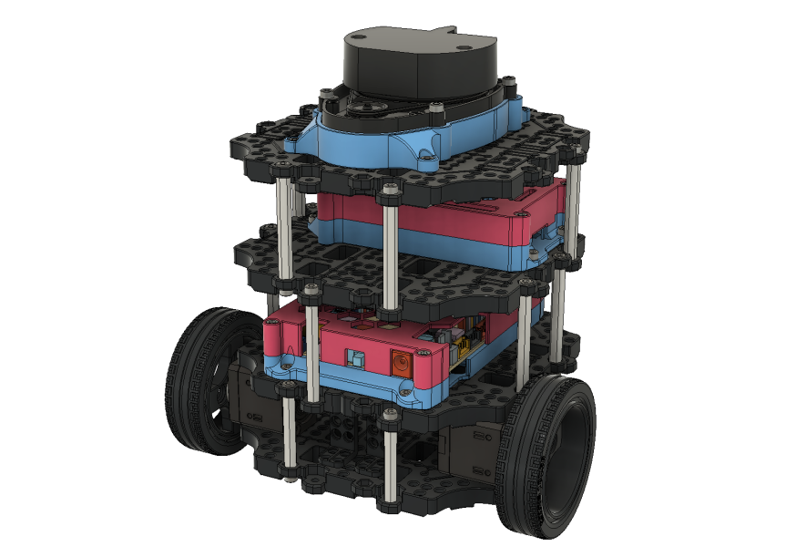

# **MICHELANGELO - CAD FILES - (vX)**

This folder contains the master assembly file for the MICHELANGELO mod kit, it is available in 2 different formats (**.f3z** & **.step**). The image below depicts the contents of the assembly files.

The MICHELANGELO mod kit was developed in **Fusion 360**, if this is your native CAD program I recommend downloading the **.f3z** format of the master assembly. This will provide you with the master assembly and all of the individual linked sub-assemblies. The .f3z file also contains captured design history of each part, for ease of personal modification. 

If you are **not** a **Fusion 360** user, you can still download the neutral format of the master assembly (**.step**). This variant, however, exists as single standalone assembly and does not contain any of the captured design history.

**Special License Considerations & Credits:**

[1] - The sub-assembly "RPi Case - Assembly" was based upon the work of Thingiverse user "[0110-M-P](https://www.thingiverse.com/0110-M-P)" and is licensed as follows:

 RPi Case - Assembly by <a xmlns:cc="http://creativecommons.org/ns#" href="https://github.com/travisguy-exe/LEONARDO-turtlebot3-wafflepi-upgrade-kit" property="cc:attributionName" rel="cc:attributionURL">Travis Guy</a> is licensed under a <a rel="license" href="http://creativecommons.org/licenses/by-sa/4.0/">Creative Commons Attribution-ShareAlike 4.0 International License</a>. Based on a work at <a xmlns:dct="http://purl.org/dc/terms/" href="https://www.thingiverse.com/thing:922740" rel="dct:source">https://www.thingiverse.com/thing:922740</a>.

[2] - The standard CAD assets of the Turtlebot3 Waffle Pi unit were obtained from Robotis, and can be found at the following link:

https://cad.onshape.com/documents/179d4ba2a1f9231f93cae6e2/w/71e9066aee42d5039f880e2f/e/3cb7d487c93655e7067a3d5f

