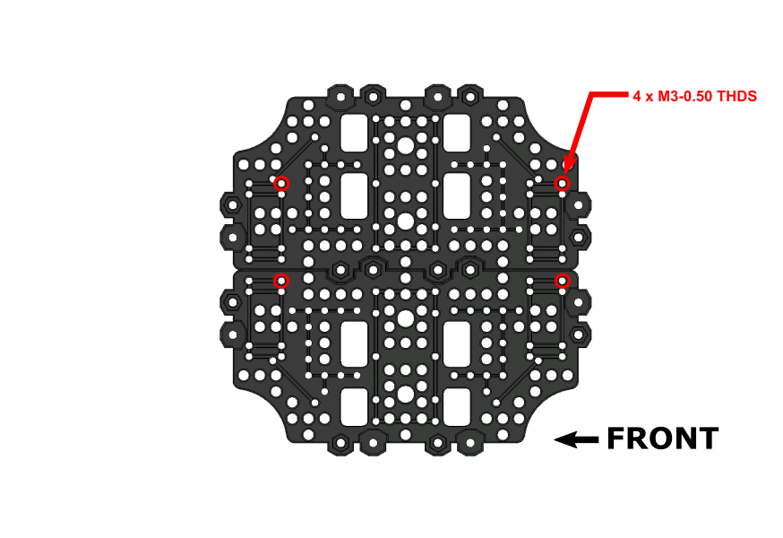

# MICHELANGLEO - Turtlebot3 (Burger) Upgrade Kit

**A 3D printable, open-source upgrade kit for the Turtlebot3 Burger from Robotis.**

 The <a xmlns:cc="http://creativecommons.org/ns#" href="https://github.com/travisguy-exe/MICHELANGELO-Turtlebot3-Burger-Upgrade-Kit" property="cc:attributionName" rel="cc:attributionURL">MICHELANGELO - Turtlebot3 Burger Upgrade Kit</a> by Travis Guy is licensed under a <a rel="license" href="http://creativecommons.org/licenses/by-nc-sa/4.0/">Creative Commons Attribution-NonCommercial-ShareAlike 4.0 International License</a>.

## **Kit Overview**

The Michelangelo upgrade kit is intended to increase the overall modularity and usability of the Turtlebot3 Burger platform. This is a valuable upgrade for anyone looking to improve the physical user friendliness, durability and modularity of their Turtlebot3 Burger unit. The following list outlines the key features of the Michelangelo Kit.

####  **Kit Features:**

- **Enclosures:** Fully 3D printable enclosures for both the Burger's **Raspberry Pi** and **OpenCR** boards, with solid mounting points.
- **Multi-Generation Support:** The MICHEALANGELO kit supports both the  Raspberry Pi 3B+ and the Raspberry Pi 4 versions of the Turtlebot3 Burger. This project repository contains unique Raspberry Pi enclosure models for both versions of the Burger.  
- **Solid LIDAR Mount:** A 3D printable solid mount for the LDS-01 LIDAR unit.
- **Improved User Experience**: The MICHELANGELO kit reimagines the construction of the Turtlebot3 burger making it easier to access key ports on the system's control boards. At the same time the  kit's reconstruction makes the robot easier to disassemble and customize.
- **Improved Modularity:** The MICHELANGELO upgrade kit adds modular enclosures and mounts to all of the key components of the Turtlbot3 Burger. This allows each of these components to easily be relocated, swapped out or customized as the user see's fit. CAD documentation for all models are included in this repository to allow users to create their own custom variants depending on their needs.

## **Repository Overview**

This repository contains all of the files and instructions necessary to upgrade a standard Turtlebot3 Burger unit with the MICHELANGELO kit. It as well contains all of the CAD documentation that one would require to add their own features to this upgrade kit. The following list provides detail on each of the sub-folders within this directory and where to locate relevant information within them.

**Repository Folders:**

- **3D Printing Files:** This folder contains all of the necessary **STL** files for printing the upgrade kit's parts, as well as, instruction for post processing.

- **CAD Files:** Contained within this folder are the **Fusion 360** and **.step** solid models for the MICHELANGELO Kit assembly and its sub-assemblies.

  

------

## **Project Log**

The MICHELANGELO project is still under active development, which means features will be added to this repository as time goes on! Refer back to this log to see what is upcoming and what I have added!

### Work In Progress.

- Youtube Assembly/Overview Video

### Completed Work

2022/04/30 - Project Inception

	- CAD Files - MICHELANGELO v44 Master Assemblies
	- Assembly Documentation
	- STL Files/3D Printing Documentation

------

## Bill of Materials

The following table outlines the items required to complete the MICHELANGELO upgrade:

| Item/Description                                     |   Qty.    |                                             |
| :--------------------------------------------------- | :-------: | :-----------------------------------------: |
| Turtlebot 3 Burger Kit                               |     1     |     |
| **M3-0.5 x 6mm** - Socket Head Cap Screw - (42 Max.) | 12 (Min.) |        |
| **M3-0.5 x 16mm** - Socket Head Cap Screw            |    12     |        |
| **M3-0.5 x 6mm** - Pan Head Screw (NYLON)            |     8     |  |
| **M3-0.5 x 12mm** - Pan Head Screw (NYLON)           |     2     |  |

# **Assembly Instructions**

​	This section outlines the assembly instructions for the MICHELANGELO Upgrade Kit. These instructions assume that you have purchased all items in the **Bill of Materials** section and have 3D printed all relevant upgrade parts in accordance with the instructions laid out in the readme of the **3D Printing Files** folder.

------

### Step 1: TB3 Burger First Layer Assembly

------

The MICHELANGELO upgrade kit uses the **"First Layer Assembly"** from the standard Turtlebot3 Burger kit. Specific instructions for assembling the **"First Layer Assembly"** can be found on **Pages 11-15** of the Robotis Turtlebot3 Burger Assembly Manual. Once assembled, the **First Layer Assembly** can be set aside until **Step 4**

**Robotis Assembly Manual (Direct Download):** https://www.robotis.com/service/download.php?no=748

------

### Step 2: TB3 Burger Waffle Plate Assembly (x3)

------

The MICHELANGELO kit uses the standard Burger waffle-plate assembly for all layers of the build. **Three** additional waffle-plates can be assembled at this point using the standard hardware from the Burger kit. These assembled waffle-plates can be set aside for later use in **Steps 3, 9 and 14**.

Instructions on **"Waffle-Plate Assembly"** can be found on **Page 9** of the Robotis Turtlebot3 Burger Assembly Manual. 

------

### Step 3: Second Layer Tap Locations ( OpenCR Enclosure Mounting)

------

In order to attach the OpenCR board enclosure to a waffle-plate assembly, **4 pre-existing** holes must be modified. The image above indicates the relevant hole locations for tapping, an **M3-0.5** tap is required for this process. 

**NOTE:** Orientation of the second layer waffle-plate matters from this step onwards. Be sure to follow the orientation indicators for each subsequent step.

------

### Step 4: Second Layer Standoffs + OpenCR (Lower Enclosure) Installation

------

Attach the **OpenCR Lower Enclosure Half** to the **Second Layer Assembly** using **4 - M3x6mm Socket Screws**. Once the lower enclosure half is secured, install **5 - M3x45mm Standoffs** at the locations shown in the assembly image above. The standoffs can be attached with the standard **M3x8mm Philips** hardware from the Turtlbot3 Burger kit or an additional  **5 - M3x6mm Socket Screws**. 

------

### Step 5: Second Layer Attachment + Cable Routing

------

At this stage the **Second Layer Assembly** can be attached to the **First Layer Assembly** created in **Step 1**. However, before attachment, the **Dynamixel Motor Cables** and the **Li-Po Battery Extension Cable** from the first layer must be routed through the **Second Layer Assembly**. The image above shows the respective routing locations for each of the cables. 

A total of **4 - M3x6mm Socket Screws** screws are required to attach the second layer to the first. Alternatively, the standard **M3x8mm Philips**  hardware from the Turtlebot3 burger kit can be used in place of the socket screws. 

------

### Step 6: OpenCR Board Installation 

------

The **OpenCR** board  can now be installed into its lower enclosure half using **4 - M3x6mm Nylon Screws**. 

------

### Step 7: OpenCR Board Connections

------

Before the OpenCR board can be fully enclosed a few electrical connections must be made: 

- [ ] Attach the **Dynamixel Motor** and **Li-Po Battery Extension** cables that were routed during **Step 5** to the OpenCR board. The connection points are indicated by the **RED** and **GREEN** arrowed text in the image above. 

  **NOTE:** Ensure correct connection of the Dynamixel motors by following the motor ID legend in the **RED** arrowed text. The motor IDs are indicated below each wheel for quick reference.

  

- [ ] Connect the **R-Pi (5v) Power Cable** to the OpenCR board at the point indicated by the **YELLOW** arrowed text in the image above. Leave this cable loose for routing in a later step.

  

------

### Step 8: OpenCR Enclosure Assembly

------

The OpenCR board can now be fully enclosed with it's upper enclosure half. As indicated in the assembly image above, a total of **4 - M3x16mm** fasteners will be required for this step.

------

### Step 9:  Third Layer Tap Locations (Raspberry Pi Enclosure Mounting)

------

Whether you are using a **Raspberry Pi 3B+** or a **Raspberry Pi 4** the mounting footprint of theses enclosures in the MICHELANGELO upgrade kit are identical. These instructions apply for both models of the Turtlebot3 Burger.

In order to attach either Raspberry Pi board enclosure, **4 pre-existing** holes must be modified on the third layer waffle-plate. The **Step 3** image above indicates the relevant hole locations for tapping, an **M3-0.5** tap is required for this process. 

**NOTE:** Orientation of the third layer waffle-plate matters from this step onwards. Be sure to follow the orientation indicators for each subsequent step.

------

### Step 10:  Third Layer Standoffs + Raspberry Pi (Lower Enclosure) Installation

------

The **Raspberry Pi Lower Enclosure Half** can now be attached to the **Third Layer Assembly** using **4 - M3x6mm Socket Screws**. Once the lower enclosure half is secured, install **5 - M3x45mm Standoffs** at the locations shown in the assembly image above. The standoffs can be attached with the standard **M3x8mm Philips** hardware from the Turtlbot3 Burger kit or an additional  **5 - M3x6mm SHCS**. 

**NOTE:** This guide depicts the installation of the **Raspberry Pi 4** board. Instructions for the **Raspberry Pi 3B+** board are identical except for the usage of the relevant **3B+** enclosure pieces.

------

### Step 11:  Third Layer Attachment + Raspberry Pi Installation/Cable Routing

------

The **Third Layer Assembly** can now be attached to the main burger assembly using **5 - M3x6mm Socket Screws ** or the standard **M3x8mm Philips** hardware from the Burger kit. It is important that before fastening down the **Third Layer Assembly**, you first route the **R-Pi (5v) Power Cable** from **Step 7** up through the hole indicated by the **Yellow** arrowed text in the image above . 

Once the **Third Layer Assembly** is secured, install your Raspberry Pi unit into its mounted lower enclosure half using **4 - M3x6mm Nylon Screws**.

**NOTE:** Do not connect the **R-Pi (5v) Power Cable** during this step.

------

### Step 12:  Raspberry Pi Enclosure Assembly + Power Connection

------

The Raspberry Pi board can now be fully enclosed with it's upper enclosure half, this step requires **4 - M3x16mm SHCS**.

Once the enclosure is assembled, connect the **R-Pi (5v) Power Cable** that was routed during **Step 11** to the Raspberry Pi unit.

**NOTE:** When connecting the power cable to the Raspberry Pi it is important to connect to the correct GPIO pins. Ensure that the **Positive** lead connects to **Pin 4** and the **Negative** lead connects to **Pin 6**. 

(Refer to **Page 22** of the Turtlebot3 Burger Assembly Manual for connection information.)

------

### Step 13:  Raspberry Pi - OpenCR USB Connection & Cable Routing

------

The USB connection between the **Raspberry Pi** and the **OpenCR** board can now be made using one of the **90 Degree USB Cables** from the Turtlebot3 Burger kit. The **Green** arrowed text in the image above shows the routing path for the USB cable, it can be routed down through the **Third Layer Assembly** waffle-plate to keep the connection tidy and tucked away.

------

### Step 14:  Fourth Layer Assembly and Tap Locations

------

The **Fourth Layer Assembly** of the MICHELANGELO upgrade kit slightly alters the waffle-plate construction to allow mounting of the **USB2LDS** driver board on the underside of the layer. As indicated in the assembly image above it is important to leave the **LEFT** two waffle-plate fastener locations empty as they will be used in the next step.

Before proceeding to the next step a total of **4** pre-existing holes on the assembly must be tapped with an **M3-0.5** tap. These tapped holes are for attaching the the LDS-01 LIDAR mounting bracket. The **GREEN**  arrowed text in the image above indicates the relevant holes that require tapping.

 **NOTE:** Orientation of the fourth layer waffle-plate matters from this step onwards. Be sure to follow the orientation indicators for each subsequent step.

------

### Step 15:  USB2LDS Driver Board Installation

------

The **USB2LDS Module** from the Turtlebot3 kit can now be installed on the underside of the the **Fourth Layer Assembly**.  The module requires **2 - M3x12mm Nylon screws** that are fastened through the waffle-plate fastener locations left empty in **Step 14**. As indicated in the image above, the assembly also requires the **"Adapter Plate"** component from the Turtlebot3 kit, this component acts as a spacer for the module.

**NOTE:** The Nylon screws will protrude through the topside of the waffle plates. Use a pair of **flush-cut pliers** to trim the excess after the module has been tightly secured.

------

### Step 16:  LIDAR Mounting Bracket Installation

------

Turn the **Fourth Layer Assembly** back over and attach the LIDAR mounting bracket to the top side using **4 - M3x6mm Socket Screws**.  The LIDAR bracket's mounting position corresponds with the 4 tapped holes made previously in **Step 14**.

------

### Step 17: LDS-01 LIDAR Module Installation

------

------

**NOTE:** Before Mounting the **LDS-01 LIDAR** unit's mounting holes will have to be modified to accept M3 sized fasteners. Drill out the unit's 4 outer mounting holes using a 3.15mm or (1/8") drill bit.

Attach the **LDS-01 LIDAR** unit from the Turltbot3 kit to the mounting bracket using **4 - M3x16mm Socket Screws**. Be sure to route the unit's data cable though the opening highlighted in **YELLOW** before fastening. Once fastened make sure to connect the **LDS-01 LIDAR** data cable to the **USB2LDS Module** on the underside of the layer.

------

### Step 18:  Fourth Layer Attachment + Raspberry Pi - USB2LDS Connection

------

The **Fourth Layer Assembly** can now be attached to the main assembly using either **5 - M3x6mm Socket Screws ** or the standard **M3x8mm Philips** hardware from the Burger kit. 

**NOTE:**  Before fastening down the **Fourth Layer Assembly**, be sure to connect the **Raspberry Pi** to the **USB2LDS Driver Board** using the remaining 90 Degree USB cable from the Turtlebot3 Burger kit.

Once these steps are complete, your Turtlebot3 Burger is ready to use. Congratulations on upgrading your Burger with the MICHELANGELO kit!  
